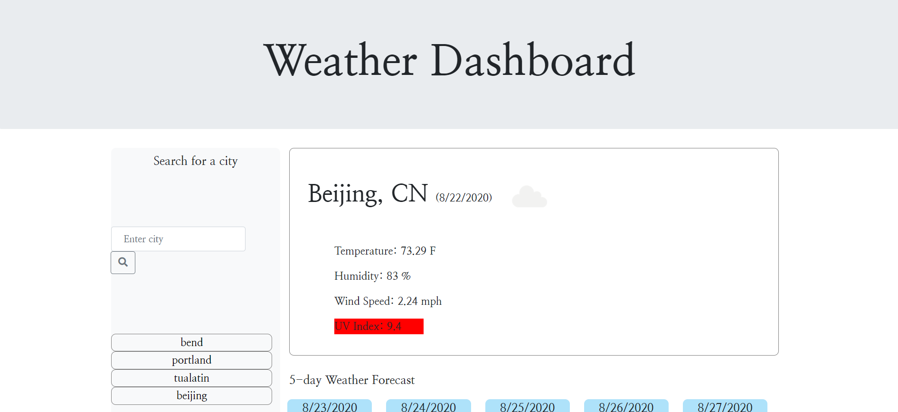
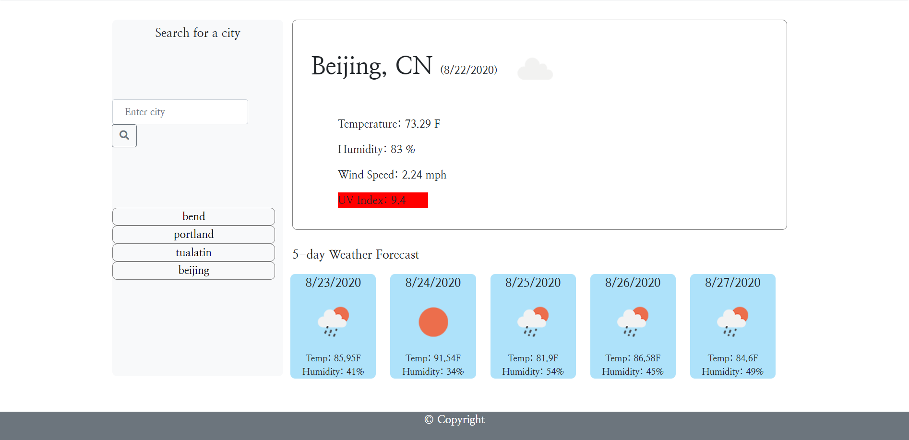

# Weather_Dashboard
This weather dashboard allows the user to search for the weather conditions of any city they input.

About:
This application allows the user to input any city around the world to obtain the current weather and the 5-day forecast. The user's search history is stored in the left column, where they can be clicked on and the weather will be shown for that correpsonding city. The information shown includes temperture, humidity, wind speed, & UV index. The icons displayed also show the weather conditions for that day. 

Instructions:

Type in a new city and click on the search button to pull up the weather data for that city. Click on the buttons in your history column to re-search for a previous city. 

Code: 

This code utilizes JavaScript, jQuery, and the use of server-side APIs to retrieve data. For this application, I used the OpenWeather API to access weather information for different cities ([OpenWeather API](https://openweathermap.org/api)). This page was also styled using Bootstrap. 

# Links 

[URL of Deployed Application](https://miadehaan.github.io/Weather_Dashboard/)

[GitHub Repository](https://github.com/miadehaan/Weather_Dashboard)

# Author Information

Author: Mia (Marianne) de Haan

Email: MariannedeHaan14@gmail.com